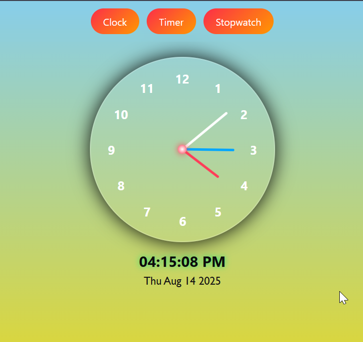
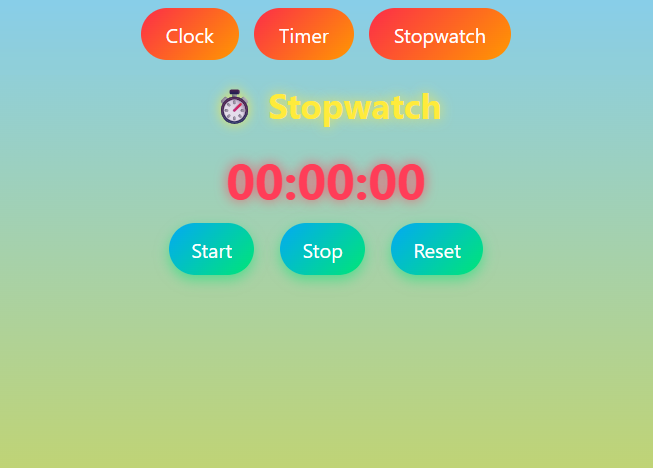
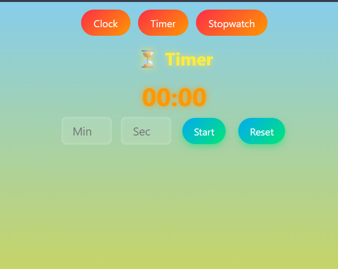

# ⏰ Time Zone Web App

This project is a **multi-functional time utility web application** that includes:
- An **Analog + Digital Clock** with dynamic day/night background themes
- A **Timer** with start, stop, and reset functionality
- A **Stopwatch** with hours, minutes, seconds tracking

The app is built with **HTML, CSS, and JavaScript** and has a modern, responsive UI.

---

## 🚀 Features

### 1. Clock
- Analog clock with smooth hand movements
- Digital clock showing current time in **AM/PM format**
- Displays current date
- **Dynamic theme**: 
  - Day theme (light sky colors) from 6 AM to 6 PM  
  - Night theme (dark gradient) from 6 PM to 6 AM

### 2. Timer
- Set custom minutes and seconds
- Start, stop, and reset options
- Alerts user when time is up

### 3. Stopwatch
- Start, stop, and reset controls
- Tracks **hours, minutes, and seconds**

---

## 📂 Project Structure

- time-zone-app/
    - │── index.html # Main HTML file (structure)
    - │── style.css # Styling (UI design)
    - │── script.js # Functionality (Clock, Timer, Stopwatch)
    - │── README.md # Project Documentation

## 🚀 Live Demo
[Click here to try the calculator](https://time-zone-vaish.netlify.app/)

---

## 📷 Screenshot

--- 
## ✨ Future Improvements

* Add world clock (multiple time zones).
* Add lap functionality in stopwatch.
* Add sound notification for timer completion.
* Make it PWA (Progressive Web App) for mobile use.
